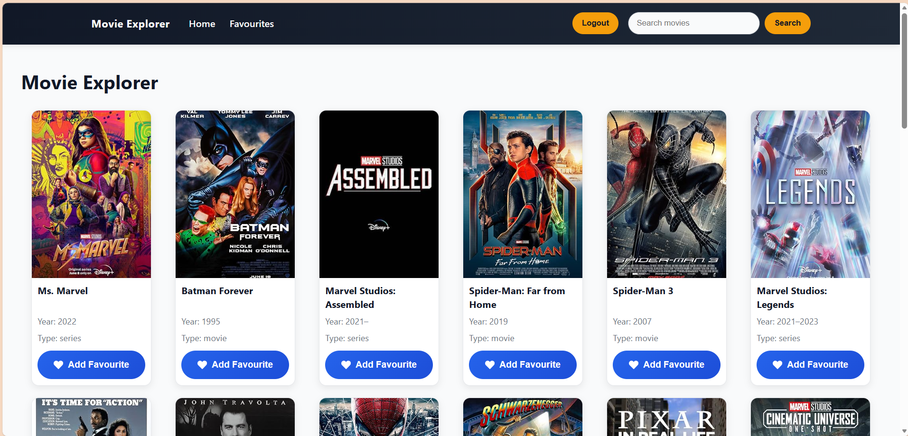
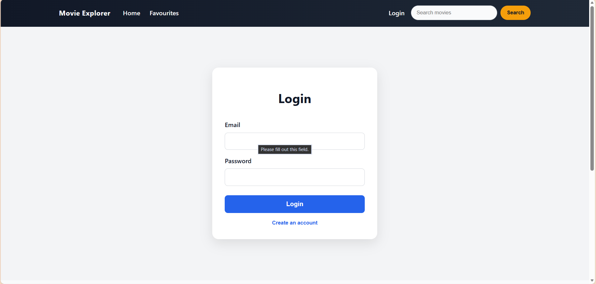
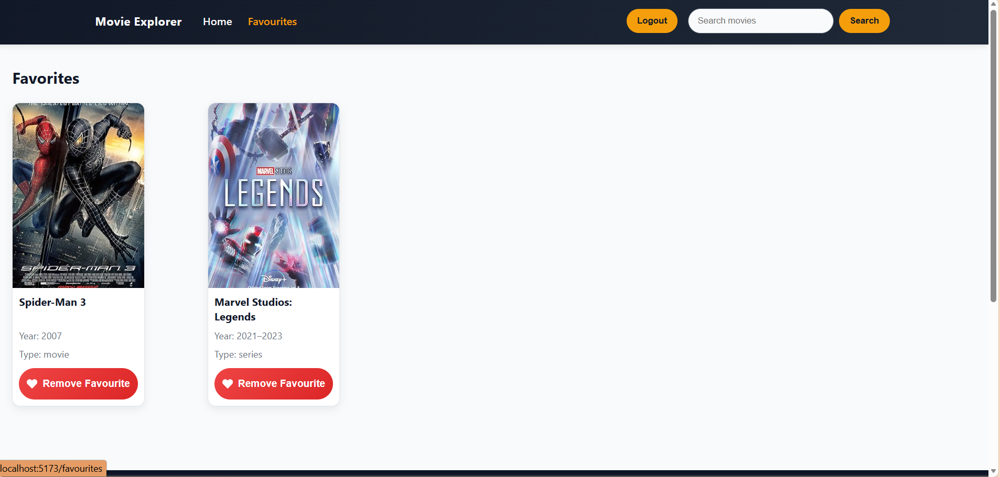

# 🎬 Movie Explorer

A modern movie discovery web application built with **React**, **TypeScript**, **Firebase**, and the **OMDb API**. Users can search for movies, authenticate securely, and save their favourite movies to their personal collection.

---

## 🚀 Features

- 🔍 Search movies using the OMDb API
- ❤️ Add and remove favourite movies
- 🔐 Firebase Email & Password Authentication
- ☁️ Store favourites in Cloud Firestore
- 👤 User-specific favourite collections
- 🛡️ Protected routes for authenticated users
- 📱 Responsive design for desktop and mobile
- 🎨 Modern UI with smooth animations
- 🖼️ Poster fallback for unavailable movie images
- 🏗️ MVVM architecture for clean code organization

---

## 🛠️ Technologies Used

- React
- TypeScript
- Vite
- React Router
- Firebase Authentication
- Cloud Firestore
- OMDb API
- CSS3

---

## 📂 Project Structure

```text
src/
│
├── components/
├── context/
├── models/
├── pages/
├── services/
├── types/
├── viewModels/
└── App.tsx
```

---

## 📦 Installation

Clone the repository:

```bash
git clone https://https://github.com/alpobanerjee374-prog/ai-capstone1
```

Navigate to the project folder:

```bash
cd YOUR_REPOSITORY
```

Install dependencies:

```bash
npm install
```

Start the development server:

```bash
npm run dev
```

Build the project:

```bash
npm run build
```

---

## 📸 Screenshots

### Home Page



### Login Page



### Favourite Movies


---

## 🌐 Live Demo

Coming Soon

---

## 👨‍💻 Author

**Alpo Banerjee**

GitHub: https://github.com/alpobanerjee374-prog

---

## 📄 License

This project is licensed under the MIT License.

---

⭐ If you like this project, consider giving it a star!